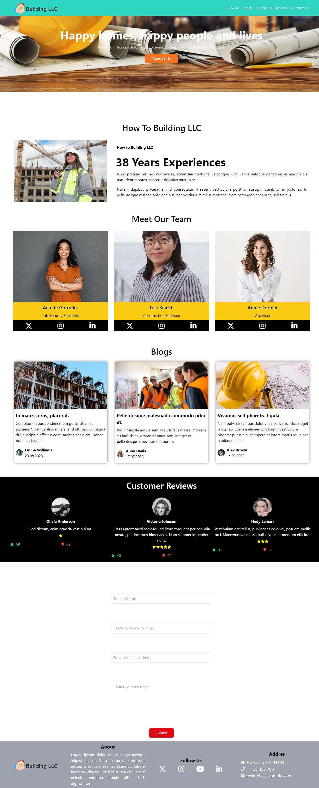

# Project Install and Run
1) Step 1 --> `pnpm create vite`  
2) Step 2 --> `pnpm run dev`, will work on `localhost:5173`

# Project Image

# Info
Construction themed website. Tailwind.css and React.Js were used.

